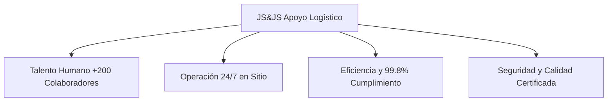
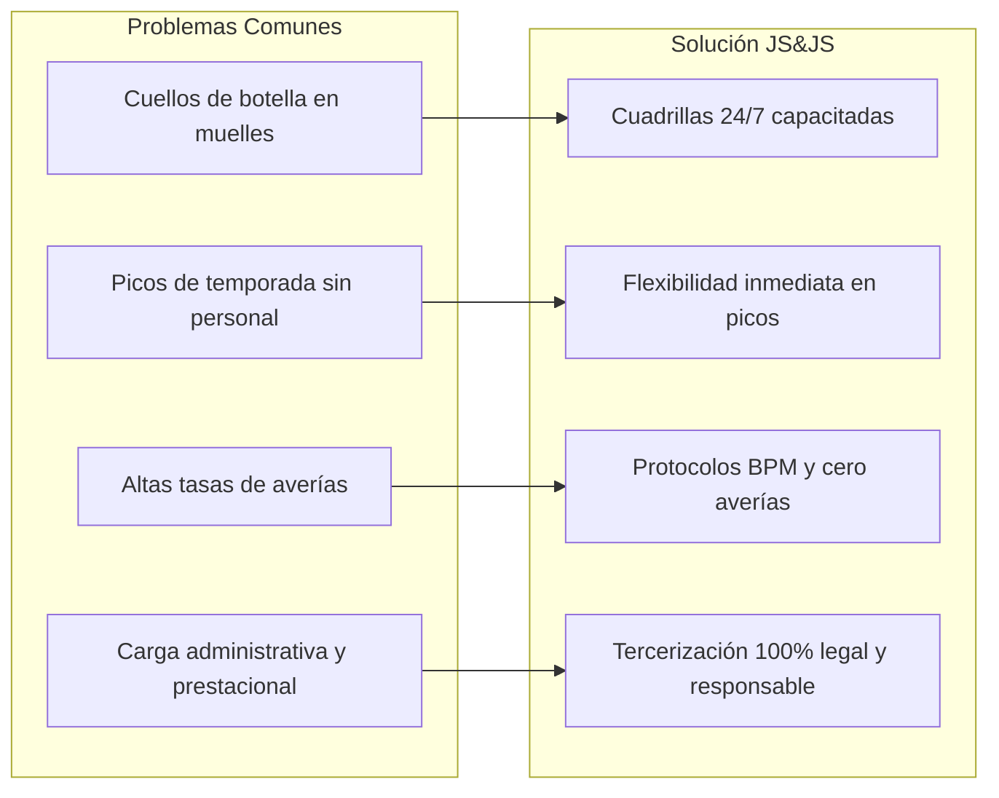

# 📦 DOSSIER CORPORATIVO & GUÍA INFORMATIVA INTEGRAL
## **JS&JS Apoyo Logístico (JSYJS Prestación de Servicios S.A.S.)**
> *Más de dos décadas construyendo confianza y transformando la logística en una ventaja competitiva.*

---

## 📑 ÍNDICE DE CONTENIDOS
1. [🏢 ¿Quiénes somos?](#1--quiénes-somos)
2. [📖 Conoce nuestra historia](#2--conoce-nuestra-historia)
3. [🚛 ¿Qué servicios ofrecemos?](#3--qué-servicios-ofrecemos)
4. [⚙️ ¿Cómo podemos ayudarte?](#4--cómo-podemos-ayudarte)
5. [👥 Nuestros Clientes y Sectores Atendidos](#5--nuestros-clientes-y-sectores-atendidos)
6. [👷 Trabaja con Nosotros](#6--trabaja-con-nosotros)
7. [📍 ¿Dónde estamos? (Ubicación y Cobertura)](#7--dónde-estamos-ubicación-y-cobertura)
8. [💼 Quiero solicitar una cotización (Canales de Contacto)](#8--quiero-solicitar-una-cotización-canales-de-contacto)

---

## 1. 🏢 ¿Quiénes somos?

### 📌 Resumen Ejecutivo
**JS&JS Apoyo Logístico** (registrada legalmente como **JSYJS Prestación de Servicios S.A.S.**) es una empresa familiar colombiana con **más de 20 años de experiencia** especializada en la tercerización y ejecución de procesos logísticos y operativos críticos. 

Acompañamos a medianas y grandes empresas en la optimización de su cadena de suministro, integrando talento humano seleccionado y capacitado, buenas prácticas de manufactura (BPM), seguridad y salud en el trabajo (SST) y supervisión continua en sitio.



### 👥 Datos Clave de la Empresa
* **Razón Social:** JSYJS Prestación de Servicios S.A.S.
* **Nombre Comercial:** JS&JS Apoyo Logístico
* **Trayectoria:** Más de 20 años en el mercado colombiano.
* **Equipo de Trabajo:** Más de 200 colaboradores operativos y técnicos capacitados.
* **Ciudades Operativas:** Mosquera, Madrid (Cundinamarca) y Medellín (Antioquia), con capacidad de cobertura nacional.
* **Indicador de Cumplimiento:** 99.8% OTIF (*On-Time In-Full*).

---

### 🎯 Misión
> *"Brindar soluciones de apoyo logístico y operativo que optimicen los procesos de nuestros clientes, eliminando cuellos de botella y generando valor a través de un servicio eficiente, confiable y de calidad, respaldado por la honestidad, el respeto, el cumplimiento y el rendimiento."*

### 🔭 Visión
> *"Ser el mejor aliado en apoyo logístico y operativo, reconocido por la excelencia de nuestros servicios y por una cultura organizacional basada en la honestidad, el respeto, el cumplimiento y el rendimiento."*

---

### 💎 Valores Corporativos

| Valor | Definición y Compromiso |
| :--- | :--- |
| 🛡️ **Honestidad** | Actuamos con integridad, transparencia y ética en todas nuestras decisiones y relaciones comerciales, generando vínculos duraderos de confianza. |
| 🤝 **Respeto** | Valoramos a las personas, fomentamos el trabajo en equipo constructivo y promovemos relaciones laborales basadas en la escucha activa y el trato digno. |
| ⏱️ **Cumplimiento** | Honramos rigurosamente cada uno de nuestros compromisos mediante un servicio oportuno, responsable y alineado con los acuerdos pactados. |
| 📈 **Rendimiento** | Buscamos la excelencia en cada etapa operativa, impulsando la productividad, la reducción de mermas y la mejora continua para generar valor tangible. |

---

## 2. 📖 Conoce nuestra historia

### ⏳ Más de dos décadas construyendo confianza
* **El Origen Familiar:** JS&JS nació como un emprendimiento familiar con una meta clara: responder a una necesidad latente en el mercado colombiano de contar con aliados operativos genuinamente confiables, comprometidos y rigurosos.
* **Evolución y Madurez:** Con el paso de los años, la compañía evolucionó desde la prestación de servicios operativos puntuales hasta consolidarse como un **aliado estratégico 360°** para grandes industrias y operadores logísticos (3PL y 4PL).
* **Consolidación en el Eje Logístico:** Establecimos nuestra base central en **Mosquera (Cundinamarca)**, el principal corredor logístico e industrial del centro del país, expandiendo operaciones hacia la sabana de Bogotá y Medellín.
* **Presente y Futuro:** Hoy en día, JS&JS gestiona cuadrillas especializadas en cuartos fríos, maquilas de alta rotación, centros de distribución masivos (CEDIs) y plantas industriales, con el propósito de **transformar la logística en la mayor ventaja competitiva de nuestros clientes**.

---

## 3. 🚛 ¿Qué servicios ofrecemos?

Ofrecemos un portafolio modular y escalable que cubre todas las etapas de la operación intralogística y de distribución:

```
                  ┌─────────────────────────────────────┐
                  │      PORTAFOLIO DE SERVICIOS        │
                  └──────────────────┬──────────────────┘
         ┌──────────────┬────────────┼────────────┬──────────────┐
         ▼              ▼            ▼            ▼              ▼
   📦 Cargue &     🚜 Operación   📋 Picking &  ❄️ Cuartos   🏷️ Maquilas &
    Descargue     Montacargas      Packing       Fríos      Acondicionamiento
```

### 1. 📦 Cargue y Descargue Especializado
* **Descripción:** Manejo técnico y eficiente de mercancías a granel, estibadas o paletizadas en muelles de recepción y despacho.
* **Características:**
  - Cuadrillas diurnas, nocturnas y 24/7.
  - Personal entrenado en estiba segura y distribución equilibrada de peso.
  - Cuidado estricto de mercancía frágil para prevenir averías.
  - Reportes de tiempo de descargue y rotación de vehículos.

### 2. 🚜 Operación de Montacargas y Equipos
* **Descripción:** Suministro de operarios certificados para el manejo seguro y ágil de montacargas eléctricos, de combustión, trilaterales y estibadores eléctricos.
* **Características:**
  - Operadores con certificación vigente y examen psicosensométrico.
  - Almacenamiento en racks de gran altura y pasillos angostos.
  - Inspección pre-operacional rigurosa según normas SST.
  - Opción de alquiler de equipos con mantenimiento preventivo incluido.

### 3. 📋 Picking, Packing y Alistamiento de Pedidos
* **Descripción:** Preparación ágil de órdenes de despacho para canales tradicionales, grandes superficies (retail) y comercio electrónico (e-commerce).
* **Características:**
  - Métodos de alistamiento eficientes (por lote, por pedido o zona).
  - Embalaje protector, zunchado, rotulado y verificación de listas de empaque.
  - Control de inventarios y trazabilidad con tecnología del cliente (WMS/RF).
  - Cero discrepancias en pedidos despachados.

### 4. ❄️ Operación en Cuartos Fríos y Cadena de Frío
* **Descripción:** Logística especializada dentro de ambientes de temperatura controlada (refrigeración y congelación desde 4°C hasta -20°C).
* **Características:**
  - Personal con dotación térmica certificada (termotrajes, botas térmicas, guantes criogénicos).
  - Tiempos de permanencia y pausas activas reguladas para preservar la salud del operario.
  - Control de rotación bajo criterios **FEFO** (*First Expired, First Out*) y **FIFO**.
  - Especialistas en carnes, avicultura, lácteos, perecederos y farmacéuticos.

### 5. 🏷️ Maquilas y Acondicionamiento Secundario
* **Descripción:** Servicios de transformación y presentación final de producto para campañas comerciales y lanzamientos de temporada.
* **Características:**
  - Armado de promociones, anchetas y kits comerciales (2x1, combos).
  - Termoencogido, retractilado y termosellado.
  - Etiquetado de precios, código de barras y registro INVIMA / sticker nacionalización.
  - Estándares de calidad y conteo unitario 100% verificado.

### 6. 🚚 Transporte y Distribución de Mercancía
* **Descripción:** Coordinación y transporte de carga local, regional y nacional.
* **Características:**
  - Flota monitoreada mediante GPS satelital en tiempo real.
  - Conductores capacitados en manejo defensivo y aseguramiento de carga.
  - Pólizas de seguro sobre mercancías.
  - Cumplimiento estricto en ventanas de entrega de clientes finales.

### 7. 👷 Suministro y Gestión de Personal Logístico
* **Descripción:** Acompañamiento con cuadrillas de apoyo operativo para cubrir aumentos de producción, incapacidades o proyectos especiales.
* **Características:**
  - Cobertura total de seguridad social, dotación y riesgos laborales (ARL).
  - Selección bajo perfiles verificados y antecedentes disciplinarios.
  - Flexibilidad para escalar o desescalar el equipo según la curva de demanda.

---

## 4. ⚙️ ¿Cómo podemos ayudarte?

Las empresas enfrentan fluctuaciones de demanda, sobrecostos laborales y pérdidas por averías. JS&JS actúa como un socio que soluciona de raíz estos dolores operativos:



### 🎯 Beneficios Directos para tu Empresa:
1. **Eliminación de Cuellos de Botella:** Agilizamos los tiempos de cargue y descargue, reduciendo los costos de sobreestadía de camiones en patio.
2. **Variabilidad de Costos:** Convierte costos fijos de nómina en costos operativos variables adaptados exactamente a tu volumen real de facturación.
3. **Cero Riesgos Laborales:** JS&JS asume la contratación directa, nómina, aportes de ley (salud, pensión, ARL, caja de compensación) y dotación del personal.
4. **Respuesta Rápida en Temporadas Altas:** Suministro inmediato de refuerzos para eventos especiales (Día de la Madre, Amor y Amistad, Black Friday, Temporada Navideña).
5. **Supervisión y Reportes en Sitio:** Líderes de cuadrilla dedicados a garantizar el rendimiento y la comunicación fluida con los jefes de bodega del cliente.

---

## 5. 👥 Nuestros Clientes y Sectores Atendidos

### 🏭 Sectores Productivos Atendidos
* 🍗 **Industria Alimentaria & Cárnica:** Manejo de pollo, carnes, embutidos y alimentos procesados bajo BPM e inocuidad.
* 🏭 **Empresas de Producción & Manufactura:** Movimiento de materias primas y salida de producto terminado.
* 🏬 **Centros de Distribución (CEDIs):** Recepción, almacenamiento en altura, cross-docking y alistamiento masivo.
* 📦 **Operadores Logísticos 3PL / 4PL:** Apoyo operativo continuo en plataformas multicliente.
* 🛒 **Comercio & Retail (Grandes Superficies):** Despachos consolidados con ventanas de entrega estrictas.
* 🥤 **Consumo Masivo:** Productos de alta rotación con empacado y paletizado rápido.

---

### 🏢 Grandes Marcas que Confían en JS&JS

```
╔══════════════════════════════════════════════════════════════════════════════╗
║  [AVINSA]          [RAMO]          [RANSA]          [CORONA]         [OCASA] ║
║  Avícola &        Consumo         Operador         Manufactura &    Logística║
║  Cárnico          Masivo          Logístico 3PL    Materiales       Express  ║
╚══════════════════════════════════════════════════════════════════════════════╝
```

* **Avinsa S.A.:** Operación en cadena avícola, cuartos fríos y conservación térmica continua.
* **Productos Ramo:** Apoyo operativo en bodegas centrales, picking intensivo y despachos masivos a nivel nacional.
* **Ransa Colombia:** Operadores certificados de montacargas en almacenamiento vertical de alta complejidad.
* **Corona:** Manipulación técnica de producto terminado pesado y frágil con cero averías.
* **Ocasa:** Agilidad en clasificación de paquetería y alistamiento de envíos urgentes.

---

### 💬 Testimonios de Clientes
> *“JSYJS se ha convertido en un aliado estratégico para nuestra operación. Su compromiso y cumplimiento han sido fundamentales para el crecimiento de nuestra empresa.”*
> — **Gerencia de Operaciones & Logística**

> *“La capacidad de respuesta y la calidad del servicio nos permiten confiar plenamente en su equipo de trabajo.”*
> — **Jefatura de Distribución y Abastecimiento**

---

### 🏆 ¿Por qué nuestros clientes permanecen con nosotros?
1. **+20 años de experiencia comprobada** en operaciones complejas y exigentes.
2. **Personal capacitado y evaluado permanentemente.**
3. **Cumplimiento riguroso en tiempos de entrega (99.8% OTIF).**
4. **Soluciones diseñadas a la medida exacta de cada cliente.**
5. **Procesos eficientes, seguros y alineados a normas SST/BPM.**
6. **Atención personalizada con comunicación directa y ejecutivos asignados.**
7. **Filosofía de mejora continua e innovación operativa.**

---

## 6. 👷 Trabaja con Nosotros

En JS&JS creemos que el crecimiento de la empresa nace del bienestar y la dignificación del trabajo de nuestros colaboradores.

### 🌟 ¿Qué ofrecemos a nuestros trabajadores?
* Contratación formal con todas las prestaciones de ley garantizadas.
* Ambiente laboral basado en el respeto, el compañerismo y la confianza.
* Capacitación continua en operación de equipos, seguridad industrial y BPM.
* Oportunidades de crecimiento y estabilidad a largo plazo.
* Trabajo directo con empresas líderes del país.

### 📝 Perfiles habituales de contratación:
* Auxiliares de Cargue y Descargue.
* Operarios Certificados de Montacargas (Eléctrico / Combustión / Trilateral).
* Auxiliares de Bodega, Picking y Packing.
* Operarios para Cuartos Fríos con experiencia en temperaturas controladas.
* Operarias y operarios de Maquilas y Acondicionamiento.
* Supervisores y Líderes de Cuadrilla Logística.

---

## 7. 📍 ¿Dónde estamos? (Ubicación y Cobertura)

### 🏢 Sede Principal
* **Dirección:** Carrera 10 # 7b - 20, Mosquera, Cundinamarca, Colombia.
* **Ubicación Estratégica:** En el corazón del eje industrial de la Sabana de Bogotá, conectando rápidamente con la Troncal de Occidente, Calle 13 y Calle 80.

### 🗺️ Cobertura Geográfica
* **Cundinamarca & Sabana:** Mosquera, Madrid, Funza, Facatativá, Tenjo, Cota, Tocancipá, Chía, Siberia y Bogotá D.C.
* **Antioquia:** Medellín y área metropolitana (Valle de Aburrá).
* **Nacional:** Cobertura de operaciones y transporte a nivel nacional según requerimiento del cliente.

---

## 8. 💼 Quiero solicitar una cotización (Canales de Contacto)

Ofrecemos asesoría y cotizaciones personalizadas tras un diagnóstico preliminar de tu volumen operativo, turnos y requerimientos técnicos:

### 📞 Canales Directos de Atención
| Canal | Detalle / Enlace |
| :--- | :--- |
| 📱 **WhatsApp Oficial** | [+57 320 833 0917](https://wa.me/573208330917?text=Hola,%20me%20gustar%C3%ADa%20solicitar%20una%20cotizaci%C3%B3n%20para%20mi%20empresa) |
| 📞 **Teléfono Celular** | [320 833 0917](tel:3208330917) |
| ☎️ **Teléfono Fijo PBX** | [(601) 829 5555](tel:6018295555) |
| ✉️ **Correo Corporativo** | [gerencia@jsapoyologistico.com](mailto:gerencia@jsapoyologistico.com) |
| 🌐 **Sitio Web Oficial** | [www.jsapoyologistico.com](http://localhost:8000) |
| ⏰ **Horario Administrativo** | Lunes a Viernes de 7:00 a.m. a 5:30 p.m. / Sábados de 8:00 a.m. a 1:00 p.m. *(Operaciones logísticas activas 24/7/365)* |

---

### 📋 Pasos para iniciar operación con JS&JS:
1. **Contacto y Diagnóstico:** Nos cuentas el tipo de mercancía, volumen mensual, sede y horarios requeridos.
2. **Propuesta Comercial a la Medida:** Diseñamos un esquema técnico-económico por horas, por turno, por tonelada o por unidad producida.
3. **Selección y Asignación de Cuadrilla:** Convocamos personal calificado con dotación y afiliaciones al día.
4. **Inicio y Supervisión Operativa:** Despliegue en sitio con seguimiento a indicadores clave de desempeño (KPIs).

---
*Documento preparado como Dossier Corporativo Oficial de JS&JS Apoyo Logístico - 2026.*
